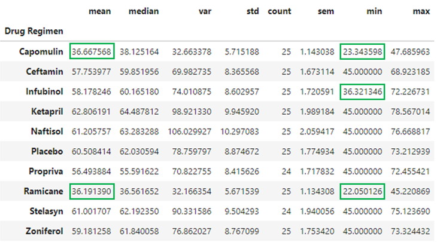
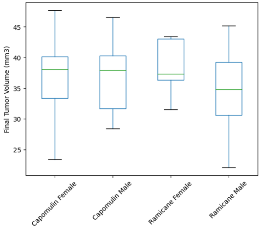

# Pymaceuticals, Inc. Research Study Analysis
Analyze a study of 249 mice identified with SCC tumors that received treatment with a range of drug regimens over the course of 45 days in which tumor development was observed andmeasured. Include results tables and charts used to determine effectiveness and correlations.

# Features
* Create a table of summary statistics
   * a row for each drug regimen eith name
   * a column for each of the following statistics: mean, median, variance, standard deviation, and SEM of the tumor volume
* Create a bar chart (using both Pandas and Matplotlib) to show total number of measurements for each drug regimen
* Create a pie chart (using both Pandas and Matplotlib) to show gender distribution
* For the most promising treatment regimens:
   * determine final tumor volume
   * calculate the quartiles and IQR
   * determine if there are any outliers and list them
   * generate a box plot that shows the distribution of the final tumor volume for all the mice in each treatment group
* Select one mouse treated with Capomulin and generate a line plot of tumor volume versus time point
* Generate a scatter plot of mouse weight versus average observed tumor volume for the entire Capomulin treatment regimen
* Calculate the correlation coefficient and linear regression model between mouse weight and average observed tumor volume for the entire Capomulin treatment regimen. Plot this on the scatter plot

# Results Summary
Refer to PymaceuticalsReport for the detailed report.

Capomulin treatments are more effective at reducing the SCC tumor size than the other drug regiments within this study except for Ramicane. More studies would help determine if there is a notable difference between Capomulin and Ramicane. Additionally, the results are independent of gender and age but highly correlated to weight. Future studies may benefit from varying dosage based on weight to further optimize outcomes.

Statistical Summary:  

Box Plots:  

# File Notes
* pymaceuticals.ipynb contains my written analysis in the top cell and the complete code to output results as indicated by the instrustions and starter code in the following cells.
* PymaceuticalsReport.*** contains the same written analysis as pymaceuticals.ipynb but with the figures and tables embedded.
* Additional_pymaceuticals.ipynb contains additional views (features) created for the report and alternate methods to achieve the original required features.
* data folder contains the two data files analyzed by pymaceuticals.ipynb
* Starter_Code folder contains the files provided in BCS/Canvas for completing the challenge.

    

# References
Data
   * Data generated by Mockaroo, LLC (https://mockaroo.com/), (2022). Realistic Data Generator.
The following references were used in creating the solution within the PyCitySchools folder:
 * Starter_Code\Pymaceuticals\pymaceuticals_starter.ipynb leveraged for file dependencies, setup, and some code execution as well as guiding output visuals

# Getting Started

## Prerequisites
You must have an environment with python 3.10+, pandas, numpy, matplotlib, scipy, jupyter notebook to execute the notebook.

## Cloning Repo
$ git clone https://github.com/vt-bekah/research_study_analysis.git

$ cd research_study_analysis

$ jupyter lab

# Built With
* Python v3.10.11
* jupyter notebook v6.5.2
* jupyterlab v3.6.3
* conda v23.5.0
* matplotlib v3.7.1
* scipy v1.10.1

**Python Modules**
* pandas v1.5.3
* numpy v1.24.3
